# Projeto Componentes MarketPlace

# Equipe
* Caio Vitor
* Dennis Phillips
* Gustavo Nakahara
* Manoel Teixeira
* Wilson Costa

# Nível 1

## Diagrama Geral do Nível 1

### Detalhamento da interação de componentes

* O `componente Usuário` dispõe de uma interface `ISeleçãoProduto` que permite que o usuário selecione um produto de uma lista obtida através da interface `IListaProdutos`.
* O `componente Marketplace` recebe do `componente Usuário` o produto selecionado através da interface `IProduto`.
* O `componente Marketplace` aciona o `componente Leilão` através da interface 'ISolicitaLeilão'.
* O `componente Leilão` publica no barramento no tópico “`leilão/demanda/<produto>`” informando que foi iniciado um leilão para obtenção dos preços do produto selecionado.
* Os componentes do tipo Fornecedor que assinam o tópico “`leilão/demanda/#`" publicam o preço do produto no barramento no tópico “leilão/lance/<produto>/<preço>”
* O componente Leilão assina o tópico “`leilão/lance/#`”, reúne os melhores lances, e passa as informações para o `componente Marketplace` através da interface `IResultadoLeilão`.
* O resultado das consultas feitas pelo `componente Marketplace`, a respeito do produto selecionado, é devolvido para o `componente Usuário` através da interface `IDetalhesProduto`.
* Com as informações obtidas, o cliente realiza seu pedido através da interface `IConfirmaPedido` do `componente Usuário`.
* O pedido é passado para o `componente Marketplace` através da interface `IPedido`. O `componente Marketplace` passa o pedido através da interface `IPedido` para o `componente ControlePedido`.
* O `componente ControlePedido` publica no Barramento B uma mensagem  com o tópico “`confirma/pedido/{código_pedido}`” contendo os detalhes do pedido confirmados pelo cliente para o pagamento.
* O `componente Pagamento`, que assina o tópico “`confirma/pedido/#`”, recebe a mensagem e guarda no `componente TransaçõesPagamento` um histórico da transação financeira, usando a interface `IPagamento`.
* O `componente Pagamento` publica no Barramento B uma mensagem contendo o status do pagamento com o tópico “`acompanhamento/{id_pedido}`”.
* O `componente ControlePedido` assina o tópico “`acompanhamento/#`” e recebe a mensagem publicada pelo `componente Pagamento`.
* O `componente Logística` assina o tópico “`confirma/pedido/#`” e recebe o pedido para a entrega e guarda no `componente TransaçõesLogística` um histórico da transação de logística, usando a interface `ILogistica`.
* O `componente Logística` publica a mensagem com o tópico “`acompanhamento/{id_pedido}`” que é recebido pelo `componente ControlePedido` que assina o tópico “`acompanhamento/#`”.
* O `Componente Usuário` obtém do `componente ControlePedido` a informacão do status do pedido através da interface `IStatusPedido`. É disponibilizada ao cliente a interface `ISolicitaStatus`.
* O componente `Gestão` obtém do `componente ControlePedido` as informações referentes aos pedidos através da interface `IPedidos`. Este componente obtém também do componente Logística informações referentes a entrega através da interface 'IStatusLogistica'.
* O componente `Gestão` disponibiliza duas interfaces aos gestores do sistema, `ISolicitaLogistica` e `ISolicitaPedidos`.

## Componente Usuário

* Componente para funcionar como View dos clientes. 
* Ele pode ser substituído de acordo com a interface gráfica utilizada pelo usuário. 
* Disponibiliza interfaces para que o cliente selecione um produto, confirme o pedido e acompanhe o status do pedido.

**Interfaces**
* ISelecaoProduto
* IConfirmaPedido
* ISolicitaStatus
* IStatusPedido
* IProduto
* IListaProdutos
* IDetalhesProduto
* IPedido

## Componente Gestão

* Componente para funcionar como View dos gestores. 
* Disponibiliza interfaces para que os gestores acompanhem a entrega e informações de todos os pedidos.

**Interfaces**
* ISolicitaPedidos
* ISolicitaLogistica
* IStatusLogistica
* IPedidos

## Componente Marketplace

* Componente para funcionar como Controller do Marketplace. 
* Acessa os Models contendo o estoque de produtos, detalhes dos produtos e cadastro dos usuários.
* Interage com o View do usuário, para enviar informações para o cliente realizar a compra e recebe os dados escolhidos do pedido.
* Aciona o componente Leilão para solicitar o leilão invertido e o componente ControlePedido para enviar os pedidos realizados.
* Recebe mensagens dos fornecedores para atualizar os Models.

**Interfaces**
* IProduto
* IListaProdutos
* IDetalhesProduto
* IPedido
* ISolicitaLeilao
* IResultadoLeilao
* IConfirmaEstoque
* IInsereProduto
* IObtemProduto
* IInsereEstoque
* IObtemEstoque
* IInsereCadastro
* IObtemCadastro

## Componente ControlePedido

* Componente para funcionar como Controller do andamento dos pedidos. 
* Recebe os pedidos feitos pelos clientes e os distribui pelo barramente para os componentes responsáveis pelo pagamento e entrega.
* Também disponibiliza interfaces para informar os gestores do MarketPlace sobre o andamento dos pedidos.

**Interfaces**
* IPedidos
* IStatusPedido
* IPedido
* IStatus
* IConfirmaPedido
* IInserePedido
* IObtemPedido

## Componente Leilão

* Componente responsável pelo controle do leilão invertido.
* Publica no barramento a mensagem com o produto demandado e recebe as ofertas dos fornecedores.
* Envia ao componente Marketplace o resultado do leilão, através da seleção dos melhores valores.

**Interfaces**
* ISolicitaLeilao
* IResultadoLeilao
* ILance
* IDemanda

## Componente Fornecedor

* Componente dos fornecedores que fazem parte do Marketplace.
* Ele possui interfaces para que os fornecedore participem do leilão invertido e façam atualizações da informações de estoque.

**Interfaces**
* IConfirmaEstoque
* IDemanda
* ILance

## Componente Logística

* Componente responsável pela entrega dos pedidos e registro destas transações.

**Interfaces**
* IStatus
* IConfirmaPedido
* ILogistica
* IStatusLogistica

## Componente Pagamento

* Componente responsável pelo pagamento dos pedidos.

**Interfaces**
* IConfirmaPedido
* IStatus
* IPagamento

## Componente Cadastro

* Componente que funciona como Model para o cadastro de usuários.

**Interfaces**
* IObtemCadastro
* IInsereCadastro

## Componente Estoque

* Componente que funciona como Model para o estoque de produtos do MarketPlace.

**Interfaces**
* IObtemEstoque
* IInsereEstoque

## Componente Produto

* Componente que funciona como Model para os detalhes dos produtos do MarketPlace.

**Interfaces**
* IObtemProduto
* IInsereProduto

## Componente Pedido

* Componente que funciona como Model para os pedidos do MarketPlace.

**Interfaces**
* IObtemPedido
* IInserePedido

## Componente TransaçõesPagamento

* Componente que funciona como Model para as transações de pagamentos.

**Interfaces**
* IPagamento

## Componente TransaçõesLogística

* Componente que funciona como Model para as transações de logística.

**Interfaces**
* ILogistica

## Detalhamento das Interfaces

## Detalhamento das Interfaces

### Interface `IConfirmaEstoque`

> Usada pelo componente Fornecedor para postar mensagens com informações de estoque de determinado produto.

**Tópico**: `estoque/região/confirma/{cod_produto}`

Classes que representam objetos JSON associados às mensagens da interface:

~~~json
{
	"codigo": "112233",
	"nome": "Pendrive",
	"marca": "Kingston",
	"setor": "Informática",
	"subsetor": "dispositivos de armazenamento",
	"detalhes-produto": 
		{
			"modelo": "DataTraveler",
			"capacidade": 16
		},
	"regiao-estoque": 
		{
			"cidade": "Salvador",
			"estado": "Bahia"
		},
	"estoque": 2000
}

~~~

Detalhamento da mensagem JSON:

**Estoque**

Atributo | Descrição
-------| --------
`código` | `Código de identificação do produto no Marketplace`
`nome` | `Nome associado ao produto`
`marca` | `Nome comercial do fabricante`
`setor` | `Setor do Marketplace associado ao produto`
`subsetor` | `Sub-setor do Marketplace associado ao setor do atributo acima`
`detalhes-produto` | `Mensagem JSON com detalhes específicos ligados ao produto em questão. O conteúdo dessa mensagem JSON se adapta ao tipo e setor do produto em questão`
`região-estoque` | `Mensagem JSON com o local do estoque`
`estoque` | `Quantidade de itens em estoque`

**Região do Estoque**

Atributo | Descrição
-------| --------
`cidade` | `Nome da cidade onde está localizado o estoque`
`estado` | `Nome do estado onde está localizado o estoque`

**Detalhes do Produto**

Atributo | Descrição
-------| --------
`modelo` | `Modelo associado ao produto`
`capacidade` | `Capacidade de armazenamento do produto`

### Interface `IDemanda`

> Usada pelo componente Leilão para iniciar o leilão de preços de um determinado produto.

**Tópico**: `leilão/demanda/{cod_produto}`

Classes que representam objetos JSON associados às mensagens da interface:

~~~json
{
	"código": 112233,
	"timestamp": "18-09-2020T11:33:00"
}

~~~

Detalhamento da mensagem JSON:

**Demanda do Leilão**

Atributo | Descrição
-------| --------
`código` | `Código do produto no Marketplace`
`timestamp` | `Horário em que o leilão foi iniciado`

### Interface `ILance`

> Usada pelo componente Fornecedor para publicar mensagens com o preço de determinado produto.

**Tópico**: `leilão/lance/{cod_produto}`

Classes que representam objetos JSON associados às mensagens da interface:

~~~json
{
	"código": "112233",
	"preço": 50.00,
	"desconto": 15,
	"timestamp": "18-09-2020T11:34:00"
}

~~~

Detalhamento da mensagem JSON:

**Lance**

Atributo | Descrição
-------| --------
`código` | `Código do produto no Marketplace`
`preço` | `Preço unitário estipulado pelo Fornecedor (em Reais)`
`desconto` | `Desconto oferecido pelo Fornecedor a ser aplicado sobre o preço (em porcentagem)`
`timestamp` | `Data e hora em que a mensagem com o lance foi publicada pelo Fornecedor`

### Interface `IConfirmaPedido`

> Interface usada pelo componente Controle Pedido para publicar mensagens de confirmação de pedido feito por um cliente.

**Tópico**: `confirma/pedido/{id_pedido}`

Classes que representam objetos JSON associados às mensagens da interface:

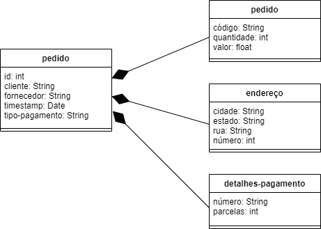

~~~json
{
	"id": 999,
	"cliente": "wilsoncosta",
	"fornecedor": "magazineluiza",
	"pedidos":
	{
		"pedido":
			{
				"codigo": "112233",
				"quantidade": 2,
				"valor": 60
			},
		"pedido":
			{
				"codigo": "223344",
				"quantidade": 1,
				"valor": 100
			}
	},
	"timestamp": "18-09-2020T11:40:00",
	"endereço":
		{
			"cidade": "Salvador",
			"estado": "Bahia",
			"rua": "Rua Asdrubal",
			"numero": 10
		},
	"tipo-pagamento": "Cartão de crédito",
	"detalhes-pagamento":
		{
			"número": "0011223344556677",
			"parcelas": 3
		}
}

~~~

Detalhamento da mensagem JSON:

**Pedido**

Atributo | Descrição
-------| --------
`id` | `Número de identificação do pedido` 
`cliente` | `Login do cliente na plataforma do Marketplace`
`fornecedor` | `Login do fornecedor na plataforma do Marketplace`
`pedidos` | `Mensagens JSON com identificação e quantidade dos produtos inclusos no pedido e valor da compra`
`timestamp` | `Data e hora em que a compra foi realizada`
`endereço` | `Mensagem JSON com o endereço para entrega do pedido`
`tipo-pagamento` | `Forma de pagamento utilizada no pedido`
`detalhes-pagamento` | `Mensagem JSON com detalhes da forma de pagamento`

**Produto incluso no pedido**

Atributo | Descrição
-------| --------
`código` | `Código de identificação do produto no Marketplace`
`quantidade` | `Quantidade de itens do produto inclusos no pedido`
`valor` | `Valor do pedido para esse produto`

**Endereço de entrega**

Atributo | Descrição
-------| --------
`cidade` | `Nome da cidade do local de entrega`
`estado` | `Nome do estado do local de entrega`
`rua` | `Nome da rua do local de entrega`
`número` | `Número do endereço de entrega`

**Detalhes do pagamento**

Atributo | Descrição
-------| --------
`número` | `Número do cartão de crédito`
`parcelas` | `Número de parcelas escolhidas para o pagamento`

### Interface `IOrdem`

> Interface usada para publicar mensagens com a criação de uma nova entrega.

**Tópico**: `confirma/entrega/{id_entrega}`

Classes que representam objetos JSON associados às mensagens da interface:

~~~json
{
	"id": 22,
	"cliente": "wilsoncosta",
	"fornecedor": "magazineluiza",
	"transportadora": "loggi",
	"nota-fiscal": "000001155",
	"endereço":
		{
			"cidade": "Salvador",
			"estado": "Bahia",
			"rua": "Rua Asdrubal",
			"numero": 10
		},
	"frete": 15.00,
	"prazo": "25-09-2020T00:00:00"
}
~~~

Detalhamento da mensagem JSON:

**Entrega**

Atributo | Descrição
-------| --------
`id` | `Número de identificação da entrega`
`cliente` | `Login do cliente na plataforma Marketplace`
`fornecedor` | `Login do fornecedor na plataforma Marketplace`
`transportadora` | `Nome comercial da empresa responsável pela entrega`
`nota-fiscal` | `Número da nota fiscal emitida para o pedido que será entregue`
`endereço` | `Mensagem JSON com o endereço para entrega`
`frete` | `Valor do frete cobrado para a entrega`
`prazo` | `Data estimada de conclusão da entrega`

**Endereço de entrega**

Atributo | Descrição
-------| --------
`cidade` | `Nome da cidade do local de entrega`
`estado` | `Nome do estado do local de entrega`
`rua` | `Nome da rua do local de entrega`
`número` | `Número do endereço de entrega`

### Interface `IStatus`

> Interface para mensagens de acompanhamento de status de pagamento e das entregas de um pedido.

**Tópico**: `acompanhamento/{id_pedido}`

Classes que representam objetos JSON associados às mensagens da interface:

~~~json
{
	"id-pedido": 999,
	"status-entregas":
	{
		"status-entrega":
		{
			"id": 22,
			"status": "A caminho"
		},
		"status-entrega":
		{
			"id": 23,
			"status": "Preparando para entrega"
		}
	},
	"status-pagamento":
	{
		"id": 15,
		"status": "Aprovado"
	},
	"timestamp": "19-09-2020T08:30:00"
}
~~~

Detalhamento da mensagem JSON:

**Status**

Atributo | Descrição
-------| --------
`id-pedido` | `Número de identificação do pedido`
`status-entrega` | `Mensagens JSON com o status das entregas`
`status-pagamento` | `Mensagem JSON com o status do pagamento`
`timestamp` | `Data e hora da atualização`

**Status da Entrega**

Atributo | Descrição
-------| --------
`id` | `Número de identificação da entrega`
`status` | `Atualização sobre o status da entrega`

**Status**

Atributo | Descrição
-------| --------
`id` | `Número de identificação do pagamento`
`status` | `Atualização sobre o status do pagamento`

# Nível 2

Apresente aqui o detalhamento do Nível 2 conforme detalhado na especificação com, no mínimo, as seguintes subseções:

## Diagrama do Nível 2

Apresente um diagrama conforme o modelo a seguir:

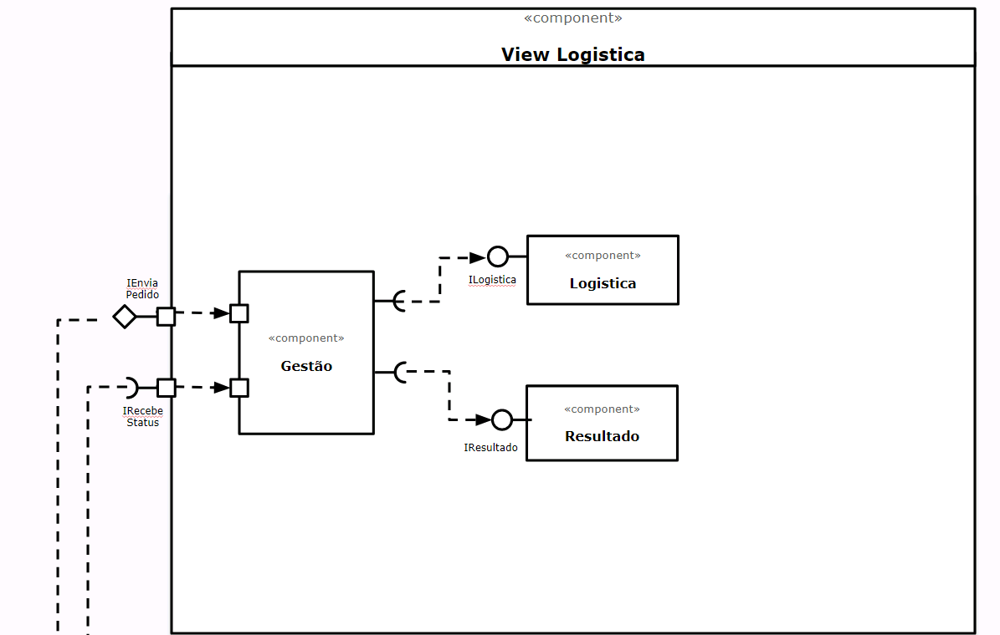
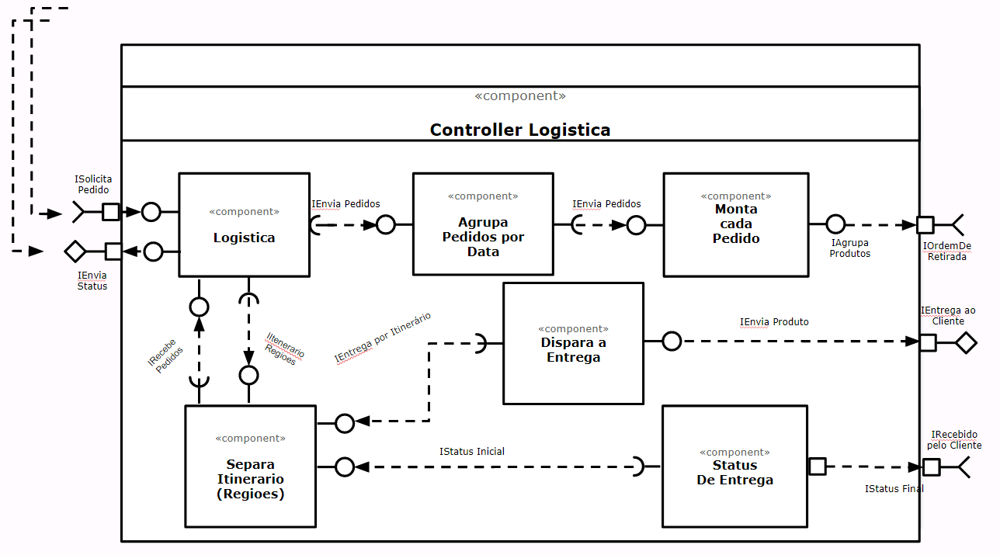

### Detalhamento da interação de componentes

* Este é o principal componente de controle e é responsável por suportar os processos de negócios, referente a logística de entrega de pedido aos
seus clientes. 
* A interação feita, através de diversas interfaces e entre elas, temos a que vai, via barramento, onde o mesmo assina um tópico sobre os pedidos
fechados.
* A partir desta captação, ele passa a fazer a gestão da organização dos pedidos e entrega dos mesmos aos clientes de todo o marketplace que é um
dos processos de negócios mais importante no nosso Marketplace.

Para cada componente será apresentado um documento conforme o modelo a seguir:

## Componente Logistica

* Este é o principal componente de controle e é responsável por suportar os processos de negócios, referente a logística de captação e entrega dos
pedidos e rastreamento dos mesmos junto aos nossos clientes do Marketplace.

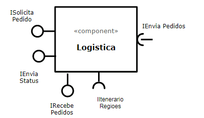

**Interfaces**
* ISolicitaPedido
* IEnviaStatus
* IEnviaPedidos
* IRecebePedidos
* IEntregaPorItinerario

## Componente `Agrupa Pedidos Por Data`

* Este componente é responsável por receber os pedidos que ja estão agrupados por data e encaminhar os mesmos para os clientes, através dos itinerários planejados para as entregas.

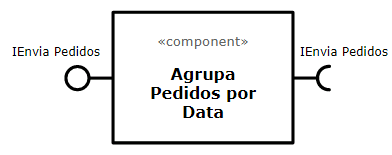

**Interfaces**
* IEnviaPedidos

## Componente Monta Cada Pedido

* Este componente é responsavel por gerir os produtos que devem ser retirados do centro de distribuicao, a partir do que consta em cada item de pedido.

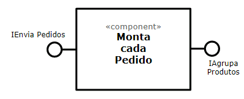

**Interfaces**
* AgrupaProdutos

## Componente Separa Itinerario (Regioes)

* Este componente é responsavel por pegar os pedidos organizadas por datas e com os seus respectivos produtos e encaminhar os mesmos para o componente, Dispara Entrega, que vai gerenciar o transporte efetivamente.

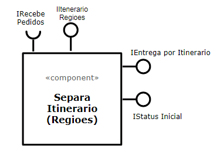

**Interfaces**
* IRecebePedidos
* IEntregaPorItinerarios
* IStatusInicial

## Componente Dispara a Entrega

* Este componente é responsavel por encaminhar os pedidos/produtos associados a transportadora que por sua vez encaminha os mesmos aos clientes, conforme itinerario já estabelecido anteriomente.

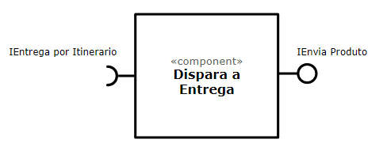

**Interfaces**
* IEntregaPorItinerario
* IEnviaProduto

## Componente Status da Entrega

* Este componente faz a gestão do status de cada pedido que esta em tramite, ou seja, sendo entregue ao cliente e associando os diversos status, a fim de permitir o rastreio pelo cliente.

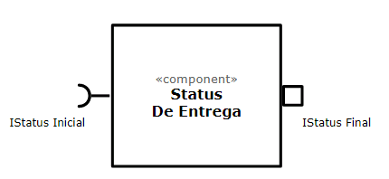

**Interfaces**
* IStatusInicial
* IStatusFinal

## Componente Gestão

* Este componente faz a gestão da View logística.

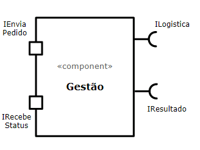

**Interfaces**
* IEnviaPedido
* IRecebeStatus
* ILogistica
* IResultado

## Detalhamento das Interfaces

### Interface ISolicitaPedidos

Ela é responsável por captar os pedidos, a fim de que os mesmos sejam tratados por outros componentes associados ao fluxo de tratamento de 
pedidos/entrega;

Método           | Objetivo
-----------------| --------
solicitaPedidos  | Faz a leitura de cada um deles e carrega num vetor | Retorna um vetor com uma lista de pedidos 
encaminhaPedidos | Le a lista de pedidos do vetor | Retorna uma lista de pedidos captados ao longo do dia

### Interface IEnviaStatus

É responsável por comunicar o status intermerdiario e final da entrega do pedido aos clientes;

Método                    | Objetivo
--------------------------| --------
enviaNotificaçãoDeStatus  | Retorno uma String com o numero do pedido e o status final.

### Interface IEnviaPedidos

Envia os pedidos para o componente, Agrupa pedidos por Data e para o componente, Monta cada pedido.

Método             | Objetivo
-------------------| --------
enviaPedidosDoDia  | Retorna uma lista de pedidos.

### Interface IAgrupaProdutos

Envia os pedidos para o componente, Agrupa pedidos por Data e encaminha para o componente, Monta cada pedido.

Método                    | Objetivo
--------------------------| --------
relacionaProdutosPorPedido | cria um conjunto MAP para relacionar pedido e produtos | Retorna uma lista de produtos por pedido.

### Interface IEntregaPorItinerario

Permite a consulta dos lotes de pedidos agrupados por dia e por regiao para serem entregues bem como a situaçao de cada um deles.

Método                 | Objetivo
-----------------------| --------
separaPedidosPorRegiao | Cria uma lista para cada regiao | Retorna uma lista de pedidos por região a ser entregue.

### Interface IStatusInicial

É respnsável por apropriar o status inicial, Entrega do Produto Iniciada, e tambem por acompanhar e evoluir com os demais status da entrega.

Método                 | Objetivo
-----------------------| --------
separaPedidosPorRegiao | Cria uma lista para cada regiao | Retorna uma lista de pedidos por região a ser entregue.

### Interface IStatusFinal

Esta permite que o status final seja apropriado, ou seja, se o ciente recebeu ou nao o produto.

Método                 | Objetivo
-----------------------| --------
notificaStatusFinal    | Cria uma mensagem com o status e o nro do pedido | Retorna o pedido e o status da entrega.

# Multiplas Interfaces

Em um sistema de comércio eletrônico do tipo shopping virtual, consideramos que existem duas jornadas de usuário de suma importância, do comprador e do lojista. Para cada uma dessas jornadas, existem inúmeras ações e operações envolvidas, distribuídas em setores como Pedido, Pagamento, Entrega e Produto. Como um sistema vivo, cada componente tem sua devida importancia, e caso algum deles apresente falhas, pode comprometer o sistema como um todo.

Do ponto de vista de escalabilidade, Marketplaces podem crescer significantemente em pouco tempo, ou também ter picos de acessos em datas específicas, como a Black Friday por exemplo. 

Um dos principais requisitos não funcionais de qualquer sistema online atualmente, é ter a capacidade de ser acessado tanto em dispositivos móveis como em desktops e notebooks.

Com estes pontos em evidência, torna-se imprescindivel optar por um ecossistema que suporte tais necessidades. Abaixo, detalharemos a escolha das linguagens e frameworks.

## Padrão de Projeto MVC

De acordo com a escolha do grupo pelo padrão arquitetural MVC, utilizaremos a linguagem Javascript em toda stack. 

Embora atualmente no ambíto online as linguagens campeãs de mercado ainda sejam .NET, PHP e Java, optamos por utilizar Javascript (Versão ECMAScript 2018) para facilitar no entendimento de código por qualquer profissional envolvido, entendemos que todos os responsáveis pela manutenção do código tenham o perfil *Full Stack*, ou seja, capaz de prover soluções nas três camadas de projeto.

### Model e Controller 
Para as camadas Model e Controller, ou *backend*, será utilizado o runtime de Javascript **Node.JS** e seu framework **Express.js**.

Além da linguagem utilizada e não exigir muitos recursos computacionais, Node.JS possui arquitetura assíncrona baseada em eventos, e apesar de *single thread*, é capaz de executar múltiplas conexões em concorrência. Possui também o repositório mais utilizado de bibliotecas web, o NPM (*Node Package Manager*).

### View (Web)
Para a camada View em ambientes web, foi escolhida a biblioteca **React** e o framework **Gatsby**.

Mantido pelo Facebook e uma comunidade de desenvolvedores individuais. React tem se provado ser extramamente flexível e agil, sendo utilizado nos sites da Netflix, Airbnb, SeatGeek, HelloSign, Walmart e outros.

Também são utilizados HTML 5 e CSS 3.

### View (App mobile Android e iOS)
Após o sucesso do React, o Facebook anunciou em 2015 o lançamento do **React Native**, sendo também uma biblioteca Javascript. Segue a filosofia *Learn once, write anywhere*.

Utiliza componentes de interface de usuário nativos tanto de Android como iOS. Oferece grandes vantagens em relação a web views em termos de performance pois não necessita de plugins para se comunicar com as APIs dos sistemas operacionais mobile.

Mesmo em apenas 5 anos da data de lançamento e atualmente na versão 0.63, o React Native já tem arsenal completo para desenvolver qualquer tipo de aplicação, não deixando nada a desejar em relação a Java (Swift) ou Objective-C

### Banco de Dados

Na disciplina anterior, INF 325, concluímos que nosso Marketplace seguirá a tendência de persistência poliglota de bancos de dados. Identificamos que a utilização de tecnologias de bancos de dados específicas para cada finalidade do sistema servirá de diferencial competitivo ao explorar o melhor de cada uma. O arcabouço de dados será composto por:

- Sistema Marketplace: MySQL

- Monitoramento e Logs: MongoDB ou Elasticsearch

- Recomendação de produtos, priorização de fornecedores: Neo4J

- Armazenamento de sessão: Redis ou Cassandra

## Comunicação Entre Camadas
O principal desafio do ponto de vista arquitetural é projetar a aplicação para utilizar os mesmos componentes independente da interface de usuário web ou mobile.

Para atingir este objetivo, em ambas views React e React Native, a comunicação será feita utilizando a mesma API desenvolvida em Node.JS, ou seja, os mesmos dados serão recuperados tanto via web como mobile. Apenas algumas diferenças do ponto de vista de detalhamento de interface serão consideradas e tratadas de acordo com cada interface.

Por exemplo, ao acessar a página inicial são exibidos os produtos em destaque do marketplace através do resultado da endpoint `/produto/exibe/destaques/{quantidade:opcional}`

Para a View Mobile, será passado o parâmetro `quantidade` para limitar a quantidade de resultados a serem retornados no formato *json*

## Diagrama da Arquitetura

[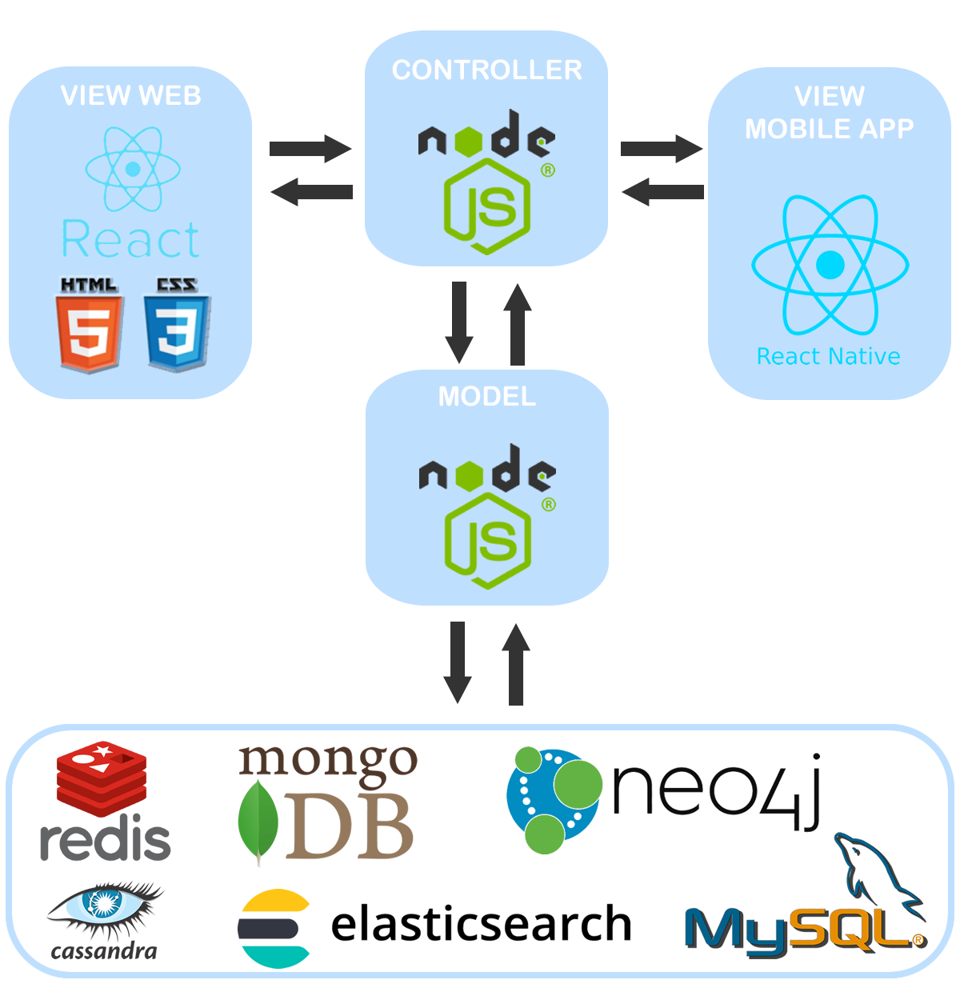](images/diagrama_plataformas_mvc.png)
