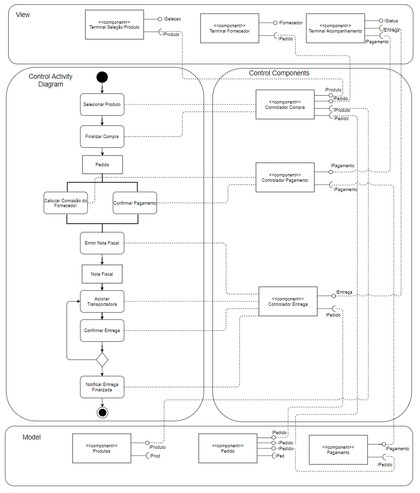

# Lab03 - Model-View-Controller

## Tarefa 4

MVC - Orquestração

MVC - Coreografia

1. No componente PainelCliente, o cliente escolhe um produto;
2. O componente ControleLeilão recebe as informações do produto desejado através da interface ILeilao;
3. O componente ControleLeilão publica uma mensagem no barramento com o tópico "demanda" contendo o produto desejado;
4. Os componentes do tipo ControleFornecedor assinam o tópico "demanda", recebem o produto e publicam uma mensagem com o tópico "lance" contendo o valor deste produto;
5. O componente Leilão assina o tópico "lance" e seleciona os três melhores lances, que são devolvidas ao componente PainelCliente.